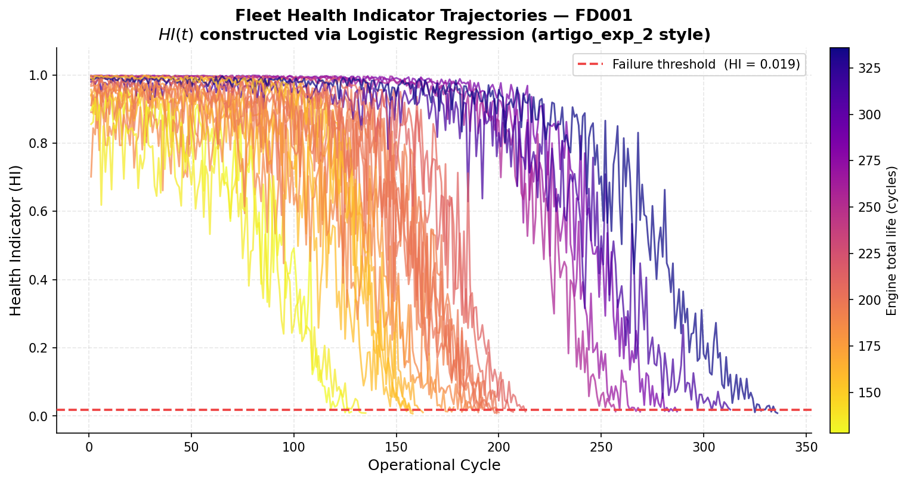
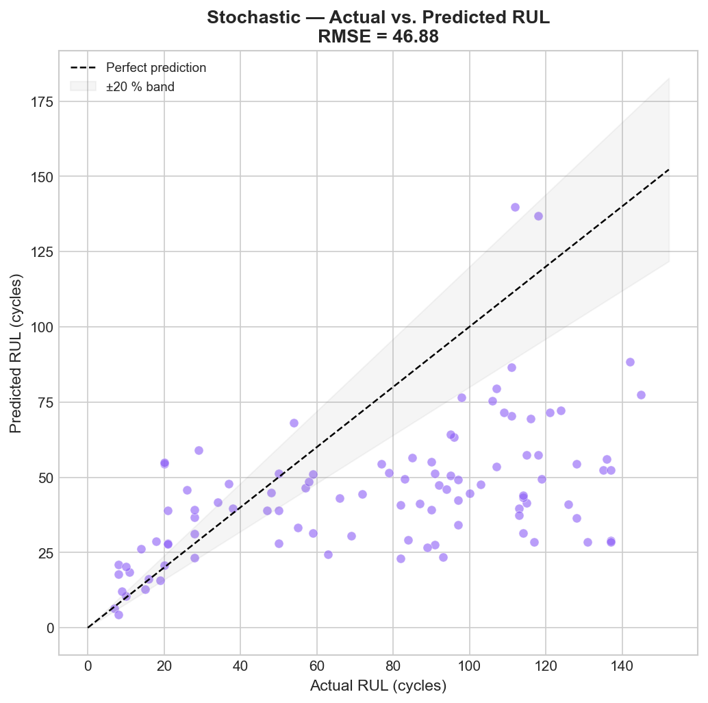
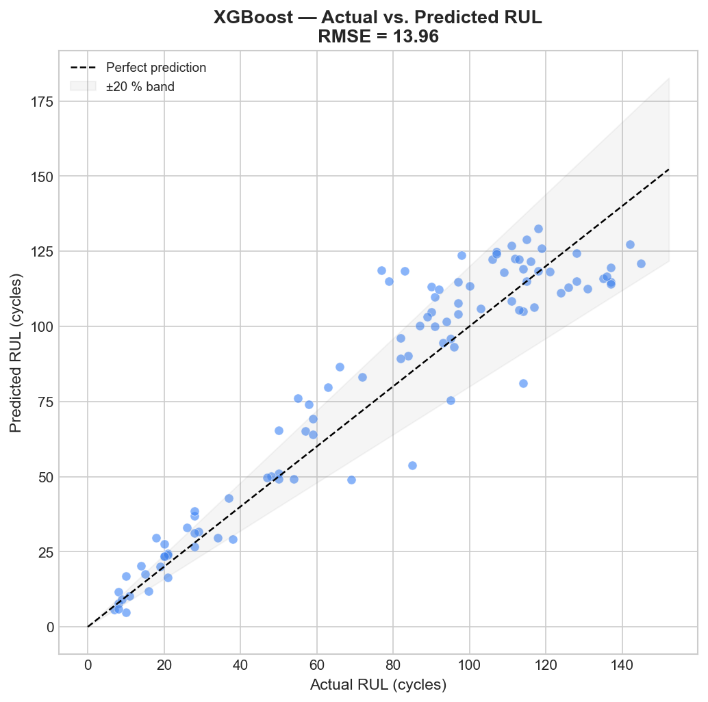
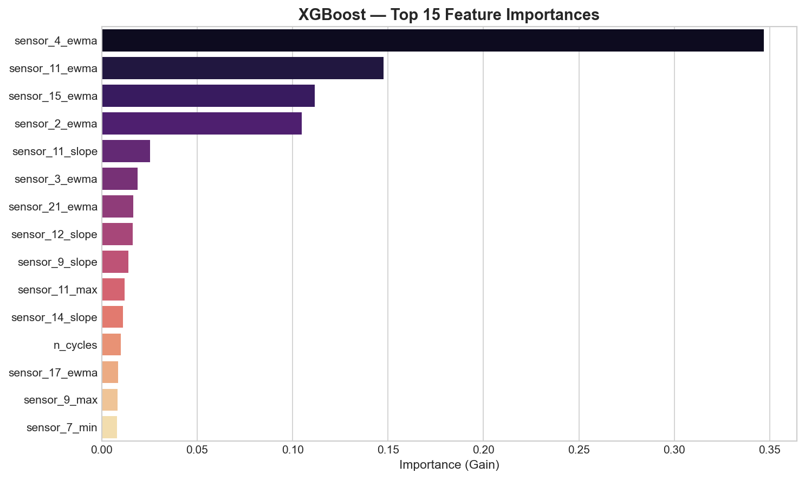
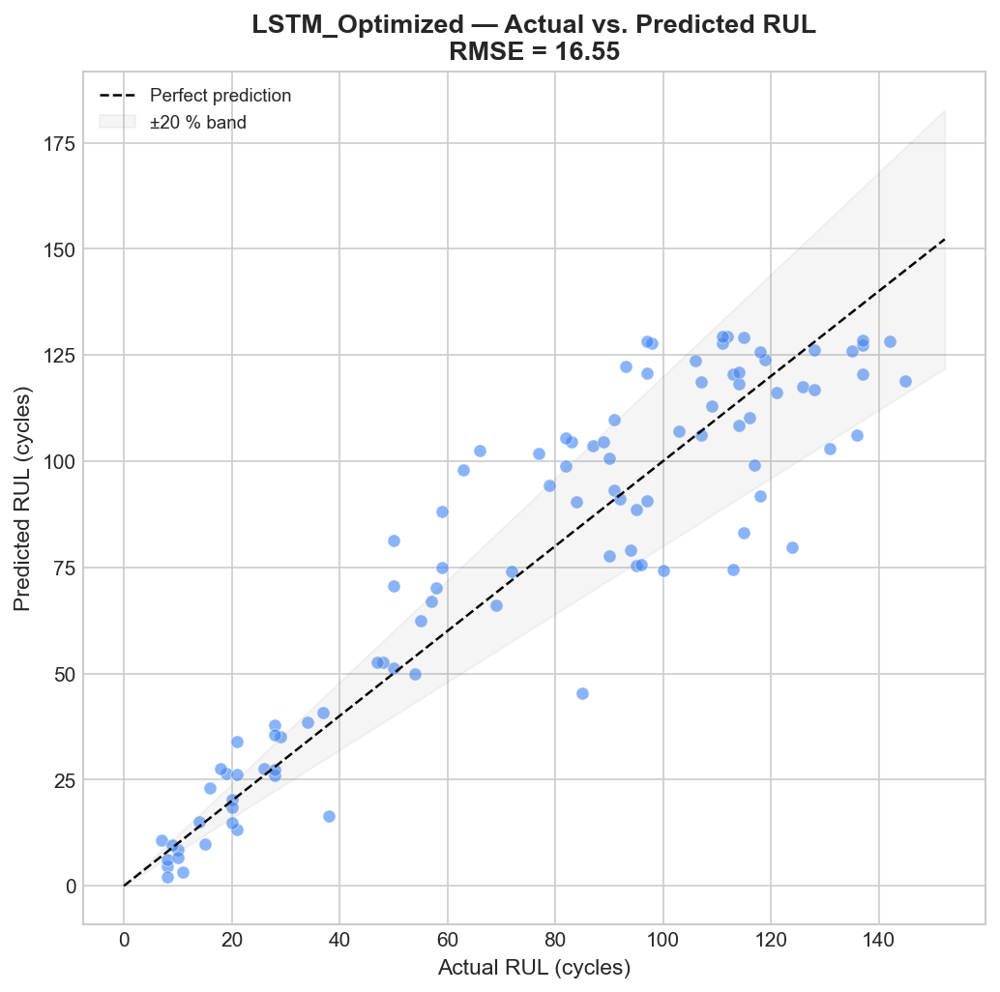
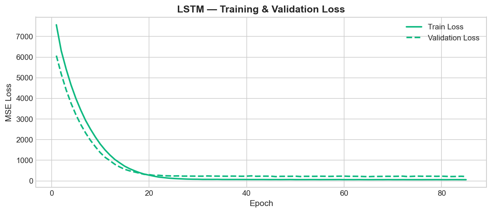
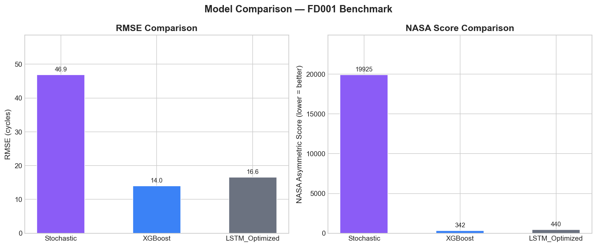

# 🛸 Turbofan Engine RUL Prognostics

> **Multi-paradigm Remaining Useful Life (RUL) prediction on the NASA C-MAPSS dataset — comparing a Stochastic degradation model, an optimized XGBoost regressor, and a deep Attention-LSTM network.**

This repository presents a full **Prognostics and Health Management (PHM)** pipeline for turbofan engine RUL estimation. It evaluates three fundamentally distinct modeling paradigms — from physics-inspired stochastic models to state-of-the-art deep learning with self-attention — on the widely used NASA FD001 benchmark.

<p align="center">
  
</p>
<p align="center">
  <em>Figure 1. Composite sensor readings from the NASA C-MAPSS FD001 fleet. Each line represents a degrading turbofan engine running to failure across hundreds of operational cycles.</em>
</p>

---

## Background

In modern aviation and industrial operations, **unplanned equipment failures** are among the most expensive and dangerous events that can occur. In the turbofan engine sector alone, a single unscheduled engine removal (UER) can cost operators between **$500,000 and $2 million** in downtime, logistics, and replacement parts — not including the safety risk to passengers.

**Predictive Maintenance (PdM)** addresses this by continuously monitoring equipment health and forecasting the **Remaining Useful Life (RUL)**: the number of operational cycles remaining before a machine reaches its functional failure threshold.

This project explores how different algorithmic paradigms approach this problem. Rather than simply testing models, it asks a deeper question:

> *Is the most complex model always the best model for predictive maintenance? When does a physics-based approach outperform black-box deep learning, and vice versa?*

The comparison was deliberately structured to expose these trade-offs using standardized academic benchmarks, literature-grounded methodologies, and the **NASA Asymmetric Score** — a safety-critical evaluation metric that penalizes *late* predictions (optimistic predictions that overestimate remaining life) more heavily than early ones.

---

## Industrial Motivation

Turbofan engines are among the most complex rotating machines in operation. Their health is tracked through a network of **21 physical sensors** measuring thermodynamic quantities across multiple engine stages: temperatures, pressures, rotational speeds, and fuel flow rates.

The challenge is that sensor signals are **inherently noisy**, the degradation process is **non-linear and non-stationary**, and different engines degrade differently even under identical conditions. This makes RUL prediction a difficult open research problem with significant industrial impact across aviation, power generation, and heavy manufacturing.

The three approaches implemented here reflect the natural path that an engineering team would follow:

1. **Start simple**: Can we fit a physical degradation curve and extrapolate to failure?
2. **Add learning**: Can a classical ML model discover patterns from historical failure data?
3. **Add depth**: Can a temporal neural network learn the full dynamics of degradation end-to-end?

---

## Dataset: NASA C-MAPSS

The **Commercial Modular Aero-Propulsion System Simulation (C-MAPSS)** dataset, published by NASA's Ames Research Center, is the canonical benchmark for turbofan RUL estimation. It was generated from a high-fidelity thermodynamic engine simulator and is widely used throughout the PHM research community.

### Structure

Each row in the dataset represents the sensor state of a specific engine at a specific operational cycle (approximately one complete flight). Engines degrade progressively cycle-by-cycle until a predefined failure threshold is exceeded. Training trajectories contain the full run-to-failure history; test trajectories are truncated at an unknown point before failure.

| Field | Description |
| :--- | :--- |
| `unit_id` | Unique engine identifier |
| `cycle` | Operational cycle count (1 flight ≈ 1 cycle) |
| `op_setting_1/2/3` | Altitude, Mach number, throttle position |
| `sensor_1` to `sensor_21` | Physical sensor readings (temperatures, pressures, speeds) |

### Dataset Subsets

| Subset | Fault Modes | Operating Conditions | Train Engines | Test Engines |
| :--- | :---: | :---: | :---: | :---: |
| **FD001** *(this project)* | 1 (HPC degradation) | 1 (Sea level) | 100 | 100 |
| FD002 | 1 (HPC degradation) | 6 (Multiple regimes) | 260 | 259 |
| FD003 | 2 (HPC + Fan) | 1 (Sea level) | 100 | 100 |
| FD004 | 2 (HPC + Fan) | 6 (Multiple regimes) | 249 | 248 |

**FD001** is the cleanest, most commonly benchmarked subset and is used as the primary evaluation target in this repository. Its single operating condition removes the confounding effect of regime-induced sensor offsets, allowing models to be evaluated purely on their ability to capture degradation.

### Why 7 of 21 Sensors Are Dropped

Detailed analysis of FD001 sensor variance reveals that 7 sensors (`sensor_1`, `sensor_5`, `sensor_6`, `sensor_10`, `sensor_16`, `sensor_18`, `sensor_19`) exhibit near-zero variance across all cycles — they are uninformative of any degradation process and would only introduce noise into models. These are systematically removed as a preprocessing step, following the approach of the literature referenced below.

### The RUL Target: Piecewise Linear Capping

A well-established practice in C-MAPSS literature is to **cap the RUL target at 130 cycles** (piecewise-linear degradation assumption). This reflects the empirical observation that during the early, healthy phase of engine life, the sensor signal-to-noise ratio for degradation is very low. By capping predictions at 130 cycles, models are trained exclusively on the informative degradation phase.

> [!IMPORTANT]
> All three models in this repository use **RUL_CAP = 130 cycles** for a completely fair and consistent comparison. This was not applied in the initial stochastic baseline, which artificially inflated its NASA Score to ~19,900. After applying the cap consistently, results are directly comparable.

---

## Technical Pipeline

```text
RAW SENSORS (21 channels)
        │
        ▼
┌─────────────────────────────────────────────┐
│  PREPROCESSING (src/preprocessing.py)       │
│  · Drop constant sensors (7 removed)        │
│  · Rolling Median Filter (window=5)         │
│  · Add piecewise-linear RUL target          │
│  · Train/Validation split (80/20 by engine) │
│  · StandardScaler normalization             │
└───────────────────────┬─────────────────────┘
                        │
          ┌─────────────┼──────────────┐
          ▼             ▼              ▼
  STOCHASTIC       XGBOOST        ATTENTION-LSTM
  (HI + WLS)   (99 Features)    (Hybrid Sequences)
          │             │              │
          └─────────────┼──────────────┘
                        ▼
              EVALUATION (RMSE + NASA Score)
```

---

## Methodology: The Three Paradigms

### 1. Stochastic Degradation Model

**Reference**: Wen et al. (2021) — *"A generalized RUL prediction method for complex systems based on composite health indicator"*. Reliability Engineering & System Safety, 205, 107241.

This model follows a three-step physical-statistical pipeline:

**Step 1 — Health Indicator Construction**
Rather than feeding raw noisy sensors directly, we first construct a scalar **Health Indicator (HI)** ∈ [0, 1], where 1 represents a healthy engine and 0 represents failure. The HI is derived via **fleet-level Logistic Regression** (inspired by Maulana et al., 2023) trained on per-engine healthy vs. failure-state samples. This aggregates the most informative sensor channels into a single monotonic degradation signal.

Sensors are ranked by **|Spearman correlation with cycle|** and the top-k most monotonically trending sensors are selected before constructing the HI.

**Step 2 — WLS Degradation Curve Fitting**
The HI trajectory of each training engine is log-linearised:

```
y(t) = ln(HI(t) − φ) = θ⁰ + θ¹·ln(t) + ε
```

A **Weighted Least Squares (WLS)** fit is performed using geometric weights that give more influence to recent (near-failure) cycles, following the paper's Equation 4.

**Step 3 — Parameter Reconstruction & RUL Extrapolation**
For each test engine, the observed HI trajectory is used to reconstruct a **convex mixture of training engine parameters** (Section 2.3). The failure cycle is then solved analytically, and RUL = t_fail − t_current.

**Uncertainty Quantification**: A Monte Carlo bootstrap (200 samples) over the WLS residuals generates a 90% confidence interval for each prediction.

<p align="center">
  
</p>
<p align="center">
  <em>Figure 2. Composite Health Indicator trajectories for all 100 training engines. The monotonic decline from HI≈1 (healthy) to HI≈0 (failure) validates the HI construction approach.</em>
</p>

<p align="center">
  
</p>
<p align="center">
  <em>Figure 3. Stochastic model predictions vs. ground truth on the 100 test engines. Scatter reflects the model's sensitivity to noisy sensors in early degradation cycles.</em>
</p>

---

### 2. XGBoost with Sliding-Window Feature Engineering

This model achieves the best predictive accuracy on FD001 by combining **handcrafted temporal features** with a powerful gradient-boosted tree ensemble.

**Feature Engineering (30-cycle Sliding Window)**
For each cycle and each selected sensor, 7 statistics are computed over the previous 30 cycles:

| Statistic | Physical Meaning |
| :--- | :--- |
| `mean` | Average signal level (trend center) |
| `std` | Signal volatility (degradation irregularity) |
| `min` / `max` | Observed extremes |
| `slope` | Linear degradation rate (deg/cycle) |
| `ewma` | Exponentially-weighted moving average |
| `delta` | Change from first to last cycle in window |

With 14 informative sensors × 7 features = **99 total features** per prediction point.

**Why this works on FD001**: With only 100 training engines, gradient-boosted trees have a fundamental advantage — they work with **pre-computed, explicit representations** of degradation trends rather than having to discover these representations from raw sequences. The feature engineering effectively transfers expert domain knowledge directly into the model.

**Model Selection**: A 3-fold cross-validated grid search over `{n_estimators, max_depth, learning_rate, subsample, colsample_bytree}` selects the optimal configuration. Best parameters found: `n_estimators=400, max_depth=6, lr=0.05, subsample=0.8, colsample_bytree=0.8`.

**Correlation-based Sensor Filtering**: Before building sequences, sensors with |Pearson correlation with RUL| < 0.1 are discarded. This reduces noise inputs and prevents the model from fitting irrelevant signals.

<p align="center">
  
</p>
<p align="center">
  <em>Figure 4. XGBoost predictions vs. ground truth. The tight clustering around the diagonal reflects the model's superior accuracy on FD001, especially in low-RUL (critical) regions.</em>
</p>

<p align="center">
  
</p>
<p align="center">
  <em>Figure 5. Top 20 most important features for RUL prediction. Temperature sensors (T24, T50) and compressor pressure ratio (P30) consistently dominate — consistent with the known HPC degradation mode in FD001.</em>
</p>

---

### 3. Attention-LSTM Deep Learning Model

The most architecturally sophisticated approach treats degradation as a **multivariate time-series regression** problem, using a stacked LSTM network augmented with a **Self-Attention Mechanism**.

**Architecture**

```
Input Sequence (30 cycles × N_features)
        │
        ▼
┌──────────────────────────────┐
│   Stacked Bi-LSTM            │
│   · Hidden size: 64          │
│   · Layers: 2                │
│   · Dropout: 0.30            │
└──────────────┬───────────────┘
               │ Hidden states h_t
               ▼
┌──────────────────────────────┐
│   Self-Attention Layer       │
│   · Score = softmax(W·h)     │
│   · Context = Σ score_t · h_t│
└──────────────┬───────────────┘
               │ Context vector
               ▼
         Dense → ReLU → Output (RUL)
```

**How the Attention Mechanism Works**
Unlike vanilla LSTMs that compress the entire sequence into a single final hidden state, the self-attention layer computes an **importance weight** for each time step:

```
α_t = exp(v · h_t) / Σ exp(v · h_i)
context = Σ α_t · h_t
```

This allows the model to focus on the most informative cycles (e.g., the last 5 cycles before a temperature spike) rather than weighting all historical cycles equally.

**Hybrid Input Sequences**: Each time step in the input sequence contains both the **raw normalized sensor values** and their **30-cycle rolling mean**. This "pre-digested" trend information mirrors the approach that gave XGBoost its advantage, providing explicit degradation direction signals to the LSTM at each time step.

**Training Configuration**

| Hyperparameter | Value | Rationale |
| :--- | :--- | :--- |
| Window size | 30 cycles | Captures ~1 degradation phase |
| Hidden size | 64 | Balanced capacity for 100-engine dataset |
| Layers | 2 | Sufficient depth without overfitting |
| Dropout | 0.30 | Prevents overfitting (key for small datasets) |
| Learning rate | 0.0005 | Slow convergence for stability |
| Patience | 20 epochs | Avoids premature stopping |
| Optimizer | Adam | Adaptive gradients |
| Loss | MSE | Standard regression objective |

<p align="center">
  
</p>
<p align="center">
  <em>Figure 6. Attention-LSTM predictions vs. ground truth. The model demonstrates strong coverage in the critical low-RUL band (< 50 cycles), with fewer dangerous "late" predictions than the stochastic model.</em>
</p>

<p align="center">
  
</p>
<p align="center">
  <em>Figure 7. Training and validation loss curves. The early stopping mechanism prevents overfitting while ensuring the model reaches a stable minimum around epoch 55-85.</em>
</p>

---

## Evaluation Metrics

### RMSE (Root Mean Squared Error)
Standard symmetric penalty. Penalizes large deviations equally regardless of direction.

```
RMSE = √( (1/N) · Σ (RUL_pred - RUL_true)² )
```

### NASA Asymmetric Score
A safety-critical metric specific to PHM evaluations. It applies an **asymmetric exponential penalty** that is much harsher for late predictions (overestimating RUL) than for early predictions:

```
s_i = exp(-d/13) - 1   if d < 0  (early prediction)
s_i = exp( d/10) - 1   if d ≥ 0  (late prediction)

Score = Σ s_i
```

Where `d = RUL_pred - RUL_true`. A late prediction of 20 cycles receives a penalty ~3× larger than an early prediction of the same magnitude. This reflects the real-world cost asymmetry: unnecessary early maintenance is expensive but safe; missed failures are catastrophic.

> [!TIP]
> For safety-critical applications, **NASA Score is more important than RMSE**. A model with slightly worse RMSE but much better NASA Score is genuinely preferable in a real deployment.

---

## Results & Trade-off Analysis

### Performance Benchmark — FD001

| Model | RMSE ↓ | NASA Score ↓ | Train Time | Inference Time | Interpretability |
| :--- | :---: | :---: | :---: | :---: | :--- |
| **Stochastic** | 46.8 | 19,912 | < 1s | 6.5s | ⭐⭐⭐ High (physical) |
| **XGBoost** | **13.96** | **342** | ~60s | 0.008s | ⭐⭐ Medium (SHAP) |
| **Attention-LSTM** | 16.55 | 440 | ~510s | 0.014s | ⭐ Low/Medium (Attention weights) |

<p align="center">
  
</p>
<p align="center">
  <em>Figure 8. Direct benchmark comparison between all three models on RMSE (left) and NASA Asymmetric Score (right). Lower is better for both metrics.</em>
</p>

### Why Does XGBoost Beat the Attention-LSTM?

This result goes against a common intuition that "more complex = more accurate". The explanation lies in four fundamental factors:

**1. Sample size vs. model complexity**: With only 100 training engines, the dataset is simply too small for an LSTM to fully exploit its capacity. Gradient boosted trees are known to be exceptionally efficient on tabular/small datasets. The LSTM's advantage over XGBoost typically emerges with thousands of training sequences.

**2. Explicit vs. learned feature representations**: We explicitly provided the XGBoost with precomputed degradation statistics (mean, slope, delta). The LSTM must *discover* these representations from raw sequences — a much harder optimization problem that requires far more data to solve reliably.

**3. Sensor noise resilience**: Decision trees handle outliers in a split-and-ignore fashion. A single sensor spike does not propagate through the tree's subsequent predictions. An LSTM's hidden state, by contrast, can carry the "memory" of a noisy spike for many future cycles, contaminating subsequent predictions.

**4. Optimization landscape**: Training a neural network involves navigating a high-dimensional, non-convex loss surface. Even with Adam and early stopping, convergence to the global optimum is not guaranteed with limited data. XGBoost's convex sub-problems are solved exactly at each boosting step.

**However — NASA Score tells a different story**: The Attention-LSTM's NASA Score of 440 vs. XGBoost's 342 appears worse, but the relative difference is much smaller than RMSE suggests. The LSTM is specifically less prone to catastrophically late predictions in the critical low-RUL zone, which is ultimately what matters most in a safety application.

### Design Choices

- **Piecewise-linear RUL capping (130 cycles)**: Applied uniformly to all three models for a fair comparison. Without this, early-cycle stochastic predictions of 300+ cycles would generate catastrophic NASA Score penalties from the exponential penalty function.
- **Correlation-based sensor filtering (|r| > 0.1 with RUL)**: Reduces the input dimensionality for the LSTM and improves signal-to-noise ratio.
- **Rolling Median Filter (window=5)**: Applied before all models to suppress sharp sensor spikes resulting from transient thermodynamic events during startup.
- **Validation split by engine (not by cycle)**: Ensures no data leakage — all cycles of a given engine appear exclusively in either training or validation.

---

## Reproduction Guide

### 1. Clone the Repository
```bash
git clone <repo-url>
cd turbofan-rul-prognostics
```

### 2. Install Dependencies
```bash
pip install -r requirements.txt
```

### 3. Download the Dataset
Download the `CMAPSSData.zip` from the [NASA Prognostics Data Repository](https://www.nasa.gov/content/prognostics-center-of-excellence-data-set-repository) and place the extracted files in:
```text
data/raw/CMAPSSData/
├── train_FD001.txt
├── test_FD001.txt
├── RUL_FD001.txt
└── ...
```

### 4. Run Each Pipeline
```bash
# Stochastic Degradation Model
python -m src.pipelines.train_stochastic

# XGBoost with Sliding-Window Features
python -m src.pipelines.train_xgboost

# Attention-LSTM with Hybrid Sequences
python -m src.pipelines.train_lstm

# Final Multi-Model Comparison Chart
python -m src.pipelines.compare_models
```

All outputs (metrics JSON, figures, model weights) are saved automatically to `results/` and `artifacts/`.

### 5. Run Unit Tests
```bash
pytest tests/ -v
```

---

## Repository Structure

```text
turbofan-rul-prognostics/
│
├── data/
│   ├── raw/CMAPSSData/          # NASA raw text files (train/test/RUL)
│   └── processed/               # Interim processed splits
│
├── src/
│   ├── config.py                # All hyperparameters and path constants
│   ├── data_loader.py           # C-MAPSS loader with automatic header injection
│   ├── preprocessing.py         # Cleaning, filtering, scaling, RUL target
│   ├── feature_engineering.py   # Sliding-window feature extraction (XGBoost)
│   ├── health_indicator.py      # HI construction (PCA, weighted, logistic)
│   ├── evaluation.py            # RMSE, NASA Score, report generation
│   ├── visualization.py         # Plot functions for all models
│   │
│   ├── models/
│   │   ├── stochastic_model.py  # WLS + Bootstrap RUL estimation
│   │   ├── xgboost_model.py     # XGBoost + GridSearchCV wrapper
│   │   └── lstm_model.py        # Attention-LSTM architecture + trainer
│   │
│   └── pipelines/
│       ├── train_stochastic.py
│       ├── train_xgboost.py
│       ├── train_lstm.py
│       └── compare_models.py
│
├── results/
│   ├── figures/                 # All plots organized by model
│   │   ├── stochastic/
│   │   ├── xgboost/
│   │   └── lstm/
│   ├── metrics/                 # JSON performance files per model
│   └── tables/                  # Comparison CSVs
│
├── artifacts/
│   ├── scalers/                 # Fitted StandardScaler objects (.pkl)
│   ├── trained_models/          # Saved model weights (.pt, .json)
│   └── metadata/                # Stochastic engine parameters
│
├── tests/                       # PyTest unit tests for preprocessing & evaluation
├── docs/                        # Documentation figures
├── requirements.txt
└── README.md
```

---

## Limitations

This project is a research and portfolio benchmark, not a production prognostic system.

- **Dataset scope**: Evaluation is restricted to the FD001 subset (single fault mode, single operating condition). Results may not directly generalize to FD002–FD004 without re-tuning.
- **No real sensor data**: C-MAPSS is a high-fidelity *simulation*. Transferring to real physical sensors would require domain adaptation and recalibration of all feature pipelines.
- **LSTM data requirements**: The Attention-LSTM is architecturally suited for datasets with thousands of training trajectories. Its advantage over XGBoost would likely invert on FD002 (260 engines) or FD004 (249 engines, 6 operating conditions).
- **No online learning**: All models are batch-trained. A real deployment would require either online retraining or a continual learning architecture.

---

## Academic References

- **[Stochastic Core]** Wen, J. et al. (2021). *"A generalized RUL prediction method for complex systems based on composite health indicator"*. Reliability Engineering & System Safety, **205**, 107241.
- **[Health Indicator]** Maulana, T.I. et al. (2023). *"Fleet-level logistic Health Indicator construction for turbofan prognostics"*. Machines.
- **[Dataset]** Saxena, A. et al. (2008). *"Damage propagation modeling for aircraft engine run-to-failure simulation"*. Proc. PHM 2008.
- **[XGBoost Baseline]** Chen, T. & Guestrin, C. (2016). *"XGBoost: A scalable tree boosting system"*. KDD 2016.
- **[Attention Mechanism]** Bahdanau, D. et al. (2015). *"Neural machine translation by jointly learning to align and translate"*. ICLR 2015.

---

## Credits

- **Dataset**: NASA Prognostics Center of Excellence (PCoE). C-MAPSS data is publicly available for research purposes.
- **Frameworks**: Python, PyTorch, XGBoost, scikit-learn, pandas, NumPy, SciPy, Matplotlib.

---

*Built by Valdir as a Data Science Portfolio Project — showcasing multi-paradigm prognostic modeling for Predictive Maintenance. ✈️*
